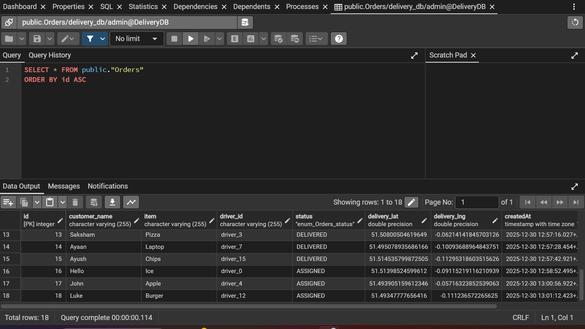

# 🚀 Real-Time Geospatial Logistics Simulator


A **high-performance, real-time geospatial logistics platform** designed to simulate Quick-Commerce delivery and manage **100+ autonomous delivery drivers** with sub-second latency.

This project demonstrates **system design at scale**, combining **real-time streaming**, **geospatial indexing**, and **transactional consistency** using a **hybrid database architecture**.

> 🔑 *Built to showcase backend performance optimization, real-time systems, and distributed data handling

---

## 🎥 Demo

📌 **Demo Video:**  
The demo video is hosted under **GitHub Issues** for easy access and versioning.

➡️ **[Click here to watch the demo](https://github.com/user-attachments/assets/fbf40c9d-359b-4420-a912-c3cc05b7031e)**  
*(Open the linked issue to view the video showcasing real-time tracking, dispatching, and live map updates)*

---

## 🏗️ Project Architecture

The system is designed to handle the **C10K problem** by clearly separating **Hot data** (real-time locations) from **Cold data** (orders & transactions).


### 🔄 Data Flow

1. **Simulator (Python)**
   - Autonomous agents calculate routes using **OSRM**
   - Push batched location updates (~20Hz) to the backend

2. **Hot Path (Real-Time)**
   - Node.js ingests location streams
   - Writes directly to **Redis (Pipelines)**
   - Broadcasts updates to clients via **Socket.io**

3. **Cold Path (Transactional)**
   - On order creation:
     - Backend queries Redis using **GEORADIUS**
     - Nearest `IDLE` driver is selected & locked
     - Order is persisted in **PostgreSQL**

---

## 💾 Data Storage Strategy

This project demonstrates a **hybrid database approach** optimized for performance and reliability.

### 1️⃣ PostgreSQL — Transactional Data

Used for **critical data that must never be lost**, such as:
- Orders
- Financial records
- Delivery history

#### Example: `orders` table

| id  | customer_name | item   | status     | driver_id | delivery_lat | delivery_lng |
|-----|--------------|--------|------------|-----------|--------------|--------------|
| 101 | Alice Johnson | Laptop | DELIVERED  | driver_5  | 51.507       | -0.127       |
| 102 | Bob Smith    | Pizza  | ASSIGNED   | driver_12 | 51.515       | -0.091       |
| 103 | Charlie Day  | Sushi  | PICKED_UP  | driver_3  | 51.490       | -0.201       |

📍 **pgAdmin Access:**  
`http://localhost:5050`



---

### 2️⃣ Redis — Ephemeral Geospatial Data

Used for **ultra-fast writes and spatial queries**.

#### 📌 Drivers GeoSet

```bash
# Redis CLI
GEORADIUS drivers -0.12 51.50 5 km ASC WITHDIST
1) "driver_5"   (0.2 km)
2) "driver_12"  (1.4 km)
3) "driver_8"   (3.1 km)
```

#### 📌 Driver Status Hash

```json
{
  "driver_5": "ASSIGNED",
  "driver_12": "IDLE",
  "driver_3": "PICKUP"
}
```

---

## ✨ Key Features

- **Real-Time Tracking**  
  Sub-second latency using **Redis + Socket.io**

- **Smart Dispatching**  
  Automatically assigns the nearest **IDLE** driver using geospatial queries

- **Smooth Animation**  
  Client-side drift interpolation converts 1Hz server ticks into **60fps motion**

- **Realistic Simulation**  
  Python agents follow real road geometry and traffic rules via **OSRM**

- **Containerized Setup**  
  Fully Dockerized (Frontend, Backend, Databases, Simulator)

---

## 🛠️ Tech Stack

### Frontend
- React.js
- Leaflet
- Socket.io-client
- CSS3

### Backend
- Node.js
- Express
- Socket.io

### Databases
- **Redis** — Geospatial indexing & caching
- **PostgreSQL** — Relational persistence (Sequelize ORM)

### Simulation
- Python
- Requests
- Polyline

### DevOps
- Docker
- Docker Compose

---

## 🚀 Installation & Setup

### Prerequisites
- Docker
- Docker Compose

### ⚡ Fast Start (Recommended)

#### 1. Clone the Repository
```bash
git clone https://github.com/yourusername/logistics-simulator.git
cd logistics-simulator
```

#### 2. Start Services via Docker
```bash
docker-compose up --build
```
This starts **Redis, PostgreSQL, Backend, and Frontend**.

#### 3. Run the Simulator (New Terminal)
```bash
cd simulator
pip install -r requirements.txt
python main.py
```

---

## 🌐 Access Points

- **Frontend Dashboard:** http://localhost:3000  
- **pgAdmin:** http://localhost:5050  
  - Email: `admin@admin.com`  
  - Password: `admin`

---

## 📡 API Endpoints

| Method | Endpoint | Description |
|------|---------|-------------|
| GET | `/api/warehouses` | Get list of warehouse locations |
| POST | `/api/driver-locations` | Batch update driver positions |
| POST | `/api/orders` | Create a new delivery order |
| POST | `/api/orders/finish` | Mark an order as delivered |

---

## 🔮 Future Improvements

- **ETA Calculation**  
  Display dynamic arrival times using OSRM duration data

- **Hot Zones Visualization**  
  Heatmaps for high-demand areas

- **Vehicle Types**  
  Scooters vs Vans with different speeds & capacities
